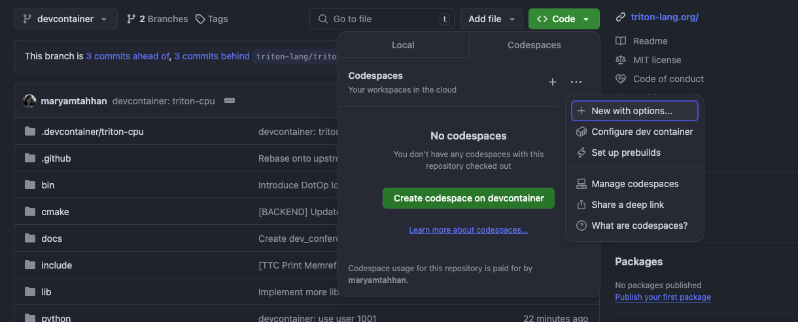
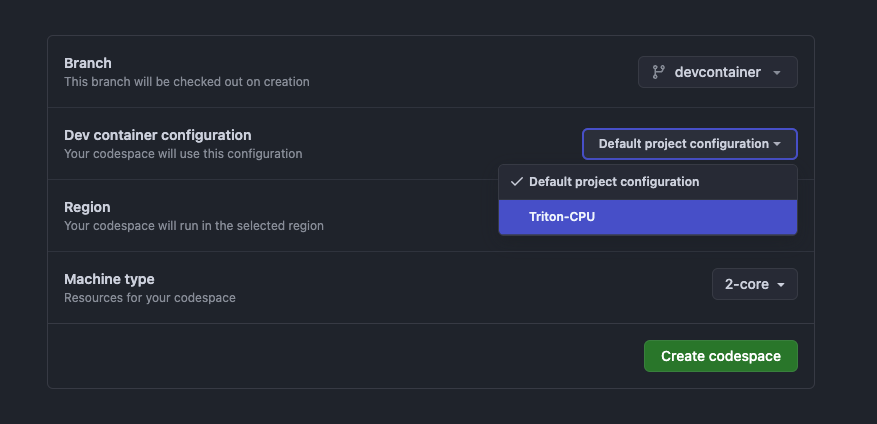
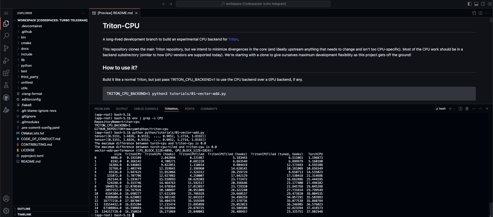

# Device Containers Getting Started Guide

This guide will walk you through using a [Development Container](https://containers.dev/)
configured with all the tools needed to build and run Triton-CPU. The Dev
Container setup is compatible with local development in Visual Studio Code
and with GitHub Codespaces for cloud-based workflows.

## Prerequisites

Details of the Prerequisites can be found [here](https://code.visualstudio.com/docs/devcontainers/tutorial#_prerequisites).

## Basic Workflow:

1. Dev Container Configuration: `.devcontainer/triton-cpu/devcontainer.json`
   file is set up with configuration details: the Docker image to use,
   extensions to install, environment variables...
   > **_NOTE_**: The devcontainer configuration provided supports both root
   (not recommended) and non-root (recommended) users.
2. Open project in Container: Open the project folder in VS Code or Github
   workspaces to build and attach the development environment.
3. Development: Work as usual, with access to tools and dependencies defined
   in the container.

The following sections will walk through Step 2 in detail.

### Running in Visual Studio Code

Follow these steps to launch and work with the Dev Container locally in Visual
Studio Code.

Open the project in Visual Studio Code. A pop up will appear asking to reopen
in project in a Dev container.


If the pop up doesn't appear, the container can be launched by accessing the
Visual Studio Code Command Palette and looking for the: `Dev Containers: Reopen in Container`
option as shown below.


Visual Studio Code will relaunch inside the Dev Container.

When the container is ready the Triton tutorials can be run as follows:

```bash
pip install -e './python[tutorials]'
```

> **_NOTE_**: This step can take a few minutes to complete.

Then:

```bash
python python/tutorials/01-vector-add.py
```

### Running in Github Codespace

Use GitHub Codespaces for cloud-based development with the same Dev Container configuration.

### Running the Tutorials in the Dev Container

1. Navigate to your repository and click the `< >Code` dropdown.

2. In the Codespaces tab, click the ellipsis (...), then select `+ New with Options`:


3. Select the Branch and the Dev Container configuration (Triton-CPU):


4. Click the Button to `Create codespace`.

When the codespace is available the Triton tutorials can be run as follows:

```bash
pip install -e './python[tutorials]'
```

> **_NOTE_**: This step can take a few minutes to complete.

Then:

```bash
python python/tutorials/01-vector-add.py
```



### Root User

If you are `root` and wish to use the dev container then please uncomment
the following lines in [devcontainer.json](./../triton-cpu/devcontainer.json)

```json
    "args":{
      // To use root (not recommended), change to 0
      "USERNAME": "0"
    }
```

Access the Visual Studio Command Palette and select the:
`Dev Containers: Rebuild and Reopen in Container` option.
